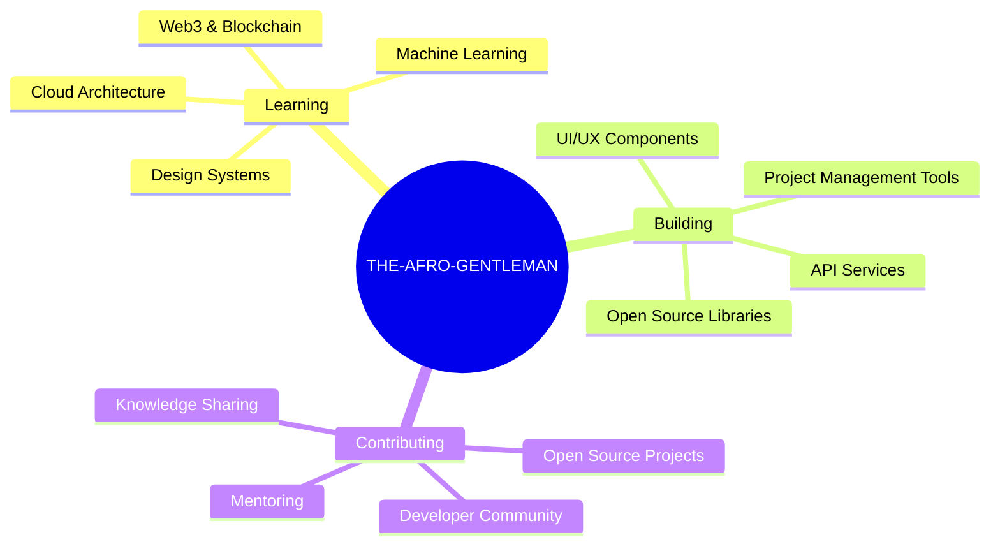

<div align="center">

<!-- Animated Header with Gradient Text -->
<h1>
  
</h1>

<!-- Profile Image with Glow Effect -->


<!-- Animated Tagline -->
<h3 style="color: #aab2ff; font-family: 'Space Grotesk', sans-serif;">
  🚀 Crafting Digital Experiences That Users Love
</h3>

<!-- Social Links with Hover Effect -->
<p>
  <a href="https://github.com/THE-AFRO-GENTLEMAN" target="_blank">
    
  </a>
  <a href="https://linkedin.com/in/YOUR_PROFILE" target="_blank">
    
  </a>
  <a href="https://twitter.com/YOUR_HANDLE" target="_blank">
    
  </a>
  <a href="mailto:your.email@domain.com">
    
  </a>
</p>

<!-- Quote Section -->
<blockquote style="background: rgba(138, 100, 208, 0.1); border-left: 4px solid #8a64d0; padding: 1rem; margin: 2rem 0; border-radius: 8px;">
  <p><em>"First, solve the problem. Then, write the code."</em></p>
</blockquote>

</div>

---

## 🧠 **About Me**

<div style="background: rgba(18, 22, 40, 0.6); border-radius: 15px; padding: 1.5rem; border: 1px solid rgba(101, 119, 236, 0.2);">

```typescript
const developer = {
  name: "THE-AFRO-GENTLEMAN",
  role: "Full-Stack Developer & UI/UX Enthusiast",
  location: "🌍 Earth",
  experience: "5+ years",
  
  currentFocus: [
    "Building scalable web applications",
    "Project management solutions", 
    "Open source contributions",
    "Clean code architecture"
  ],
  
  lifePhilosophy: "Write code that humans can read and maintain ✨"
};
```

Hello! I'm a passionate developer who specializes in creating digital experiences that users love. I believe in writing **clean, efficient code** and building applications that make a positive impact.

When I'm not coding, you can find me contributing to open source, exploring new technologies, or sharing knowledge with the developer community.

</div>

---

## 🏆 **Core Achievements**

<div align="center">

| 🎯 **Achievement** | 📊 **Impact** |
|:---|:---|
| **🚀 PM Solutions** | Built comprehensive project management platform used by development teams |
| **🎨 Design Systems** | Created minimal, reusable UI components and design patterns |
| **⚡ Open Source** | Maintained multiple repositories with active community engagement |
| **🔧 Mini Projects** | Experimented with cutting-edge technologies and shared learnings |
| **🌟 Community** | Always happy to mentor, collaborate, and learn from others |

</div>

---

## 🔥 **Featured Projects**

<div align="center">

<table>
<tr>
<td width="50%">

### 🎯 [PM-Frontend](https://github.com/Evoli-management/PM-frontend)
**Modern Project Management Interface**
- ⚛️ React + TypeScript
- 🎨 Tailwind CSS
- 📱 Responsive Design
- 🔄 Real-time Updates


</td>
<td width="50%">

### ⚙️ [PM-Backend](https://github.com/Evoli-management/PM-backend)
**Robust Backend Services**
- 🟢 Node.js + Express
- 🗄️ PostgreSQL
- 🔐 Authentication & Authorization
- 📊 API Analytics


</td>
</tr>
<tr>
<td width="50%">

### 🎨 [PM-Design-Min-01](https://github.com/THE-AFRO-GENTLEMAN/PM-Design-Min-01)
**Minimal Design System**
- 🎭 Clean UI Components
- 📐 Design Tokens
- 🎯 User-Centered Design
- 🖼️ Figma Integration

</td>
<td width="50%">

### 🔬 [Mini-Projects](https://github.com/THE-AFRO-GENTLEMAN/Mini-Projects)
**Experimental Playground**
- 🧪 Technology Exploration
- 📚 Learning Projects
- 💡 Creative Solutions
- 🔄 Continuous Learning

</td>
</tr>
</table>

</div>

---

## 💻 **Tech Stack & Skills**

<div align="center">

### **Languages**


### **Frontend**


### **Backend**


### **Tools & Platforms**


</div>

---

## 📊 **GitHub Analytics**

<div align="center">


</div>

---

## 🎯 **Current Focus**

<div align="center">



</div>

---

## 🤝 **Let's Connect!**

<div align="center">


**Always open to interesting conversations and collaboration opportunities!**

[](https://github.com/THE-AFRO-GENTLEMAN)
[](https://github.com/THE-AFRO-GENTLEMAN)

*"The best way to predict the future is to create it."* 🚀

</div>
